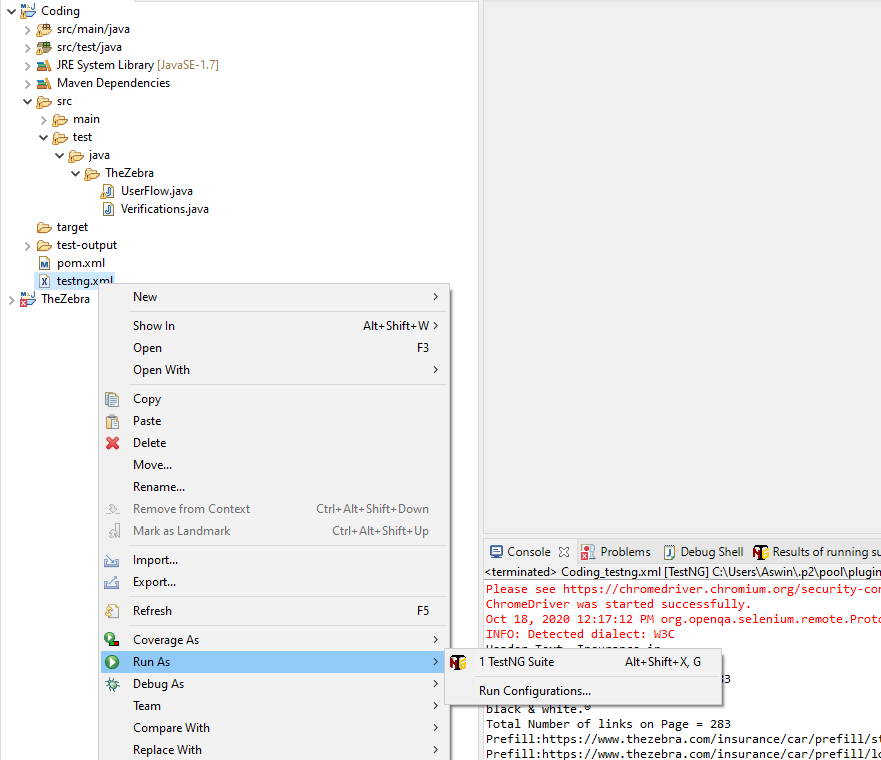

# TheZebraCodingAssessment
# The Zebra|Coding Assignment

## Usage:
Download the code and import into **eclipse** or intellij IDE.
You can run the testcases as follows: 
1. Click on the Testng.xml ->right click and run as TestNg Suite

  > **OR**
2. Select individual test cases -> right click and run as TestNg Test

## Overview

The sample test is written for The Zebra website. I have used  Java,Selenium and TestNg as the framework.

## Tests

1. **Verification** : This test cases covers basic functionality of the home page like verifying the text, current URL, enter value in a field.
					
2. **UserFlow** : This covers the end to end flow to recieve insurance quotes for car insurance. It enters the details for the user, vehicle and the driver. 

## Analysis

I used Selenium with Java because it provides flexibility to use both Java and Javascript using JavaScriptExecutor.
For the framework I have used TestNg which has various advantages like annotations, using the pom.xml file to get the dependencies, reports, capturing the logs etc.

## Framework

### Methodologies

#### Methodologies used : 
 1. TestNg Annotations  like @Test, @BeforeTest, @AfterTest.@DataProviders
 2. TestNg helper attribute - dependsOnMethods
 3. Use of TestNg.xml to run as test suite
 4. Syncronization methods - Implicit and Explicit wait
 5. Java Interface
 6. PageObjects
 7. Assertions

## Improvements

If I had more time, I would have worked on the following items:
1. Optimize the code
2. Better synchronization. Using Thread.sleep is not a good coding practice and I would want to get rid of them.
3. Remove hardcoded values and pass the data from the excel sheet or DataProvider Annotation
4. Use of Extent Reports from TestNg for detailed reporting.
5. Use of Log4j to capture the logs and get rid of print statements
6. Cover the Negative test cases.

Thanks! I enjoyed working on this assignment. I appreciate your feedback and looking forward to talking to you more.

Contact : 
Priyanka Srinivas 
priyankasrinivas37@gmail.com

